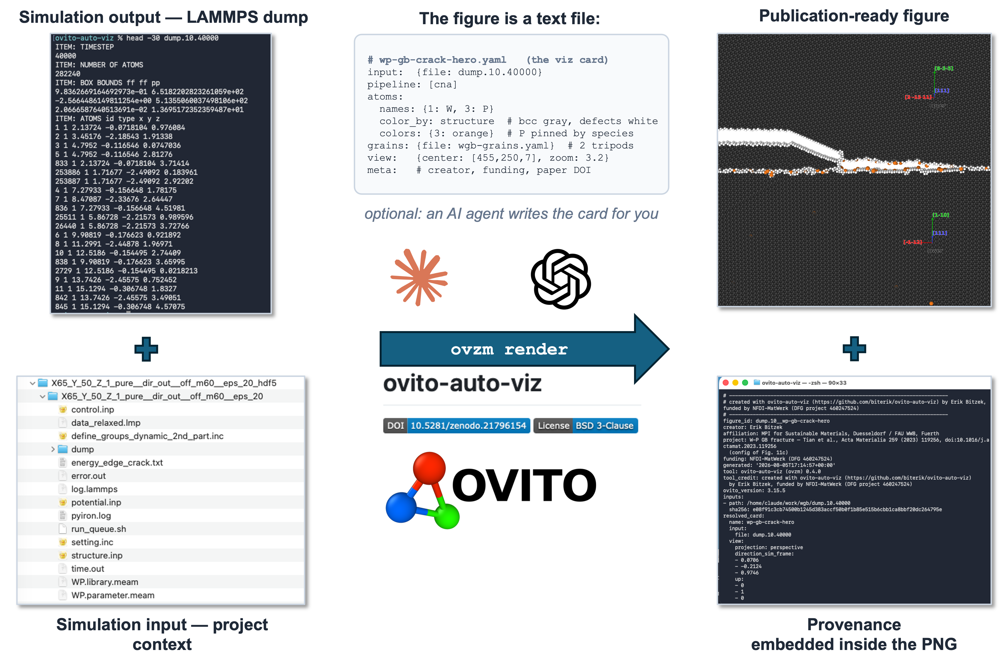
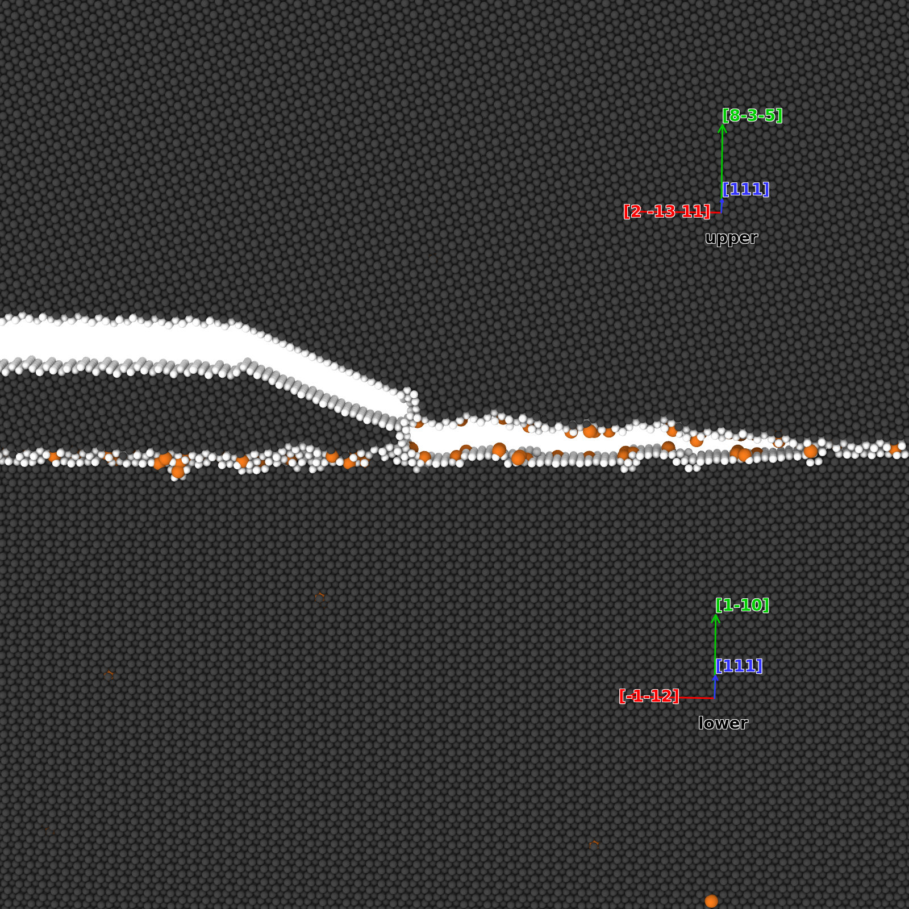

# ovito-auto-viz

[](https://doi.org/10.5281/zenodo.21796154)
[](https://github.com/biterik/ovito-auto-viz/actions/workflows/ci.yml)
[](LICENSE)

**Fast, automated, reproducible and FAIR visualization of atomistic
simulations with [OVITO](https://www.ovito.org/) — self-labeling figures
with complete metadata and provenance.**

You — or the LLM of your choice — describe the figure in a ~20-line YAML
**viz card**; the `ovzm` CLI turns
it into a publication-quality image, movie, or ready-to-open OVITO session.
Everything on the figure — Burgers vectors, line directions, character
angles, composition, colorbars, per-grain tripods — is **computed from the
data itself**. And every figure **permanently remembers** who made it, from
which data file (SHA-256), with which settings, under which funding, and
which publication it belongs to: the full provenance record is embedded
inside the PNG. Works hands-on, in scripts, on HPC clusters — and
conversationally through an LLM agent skill.



*The whole story in one picture: a LAMMPS dump and the simulation project's
context go in; a ~20-line **viz card** — written by you or by an AI agent —
tells `ovzm render` what the figure is; out come a publication-ready image
AND its complete provenance, embedded inside the PNG itself.*

## Why

Scientific figures take time to make and are amongst the **least FAIR objects** in a publication:
pixels with no metadata, produced by GUI clicks nobody can repeat, separated
from their data the moment they are exported. `ovzm` inverts this:

- **The figure is a text file.** The card is versionable, diffable,
  reviewable, and re-runs identically on your laptop or a cluster. Same
  card + same data = same figure, years later. The card can even be 
  extracted from the figure if it goes missing.
- **The physics labels itself.** DXA dislocation segments get their Burgers
  vector, line direction, and character angle computed from the data —
  nucleated defects with zero metadata are labeled just as well as
  constructed ones. Composition, colorbar limits, and crystal-axis tripods
  are derived, never typed.
- **A figure never forgets.** Creator (mandatory — the run aborts without
  it), affiliation, ORCID, project, funding, input file with SHA-256, the
  fully resolved card and scene: all of it is written to a `.prov.yaml`
  sidecar AND embedded into the PNG itself as a compressed text chunk.
  Image and provenance cannot be separated by copying, renaming, emailing,
  or archiving.
- **Comparisons are honest.** `ovzm grid` renders one card over many inputs
  with identical camera, magnification, styling, and colorbar limits — the
  manual-GUI failure mode this tool exists to kill.
- **LLM-ready by design.** The card is one shared interface for humans,
  scripts, and AI agents. With the bundled agent skill, *"glide-plane view
  of dump.1530000.gz, Cu segregation, paper quality"* becomes a rendered
  figure — the agent writes the card, collects attribution context from
  your project directory, and asks (never guesses) whatever the data cannot
  provide. The tool itself requires no AI; the skill is an optional adapter
  on top.

## The showcase figure



*A crack in tungsten runs in from the left, kinks onto a phosphorus-decorated
grain boundary, and continues along it (bcc W dark gray, defective atoms
white, P orange, one Miller-labeled tripod per grain — CNA + the
`structure_colors`/pinned-species styling and the `grains:` tripods, all from
one card). Configuration from
[Tian et al., Acta Materialia 259 (2023) 119256](https://doi.org/10.1016/j.actamat.2023.119256).
The image carries its own receipt — clone the repo and ask it where it comes
from:*

```bash
ovzm prov docs/readme-hero.png     # prints creator, input file + SHA-256,
                                   # the resolved card, and the paper's DOI
```

## Install

`ovzm` is an ordinary Python package (Python ≥ 3.9). Its main dependency,
the [`ovito`](https://pypi.org/project/ovito/) Python module (free of
charge, DXA included), is installed **automatically** by pip — you do NOT
need the OVITO desktop application. Install into a conda/mamba environment
or a venv, **never** into a system Python (many systems ship no
user-writable `pip`, and installing one globally is a good way to break the
OS package manager).

**Linux**

```bash
python -m venv ~/venvs/ovzm && source ~/venvs/ovzm/bin/activate   # or: conda activate <env>
pip install git+https://github.com/biterik/ovito-auto-viz.git
```

Headless machines (clusters, CI, containers) additionally need the GL
runtime the `ovito` module links against — no GPU or display required
(rendering uses the Tachyon software ray-tracer):

```bash
sudo apt-get install libopengl0 libegl1 libgl1 libglx0 libxkbcommon0   # Debian/Ubuntu
# Fedora/RHEL: libglvnd-opengl libglvnd-egl libglvnd-glx libxkbcommon
```

On HPC, install into a venv under scratch (never `$HOME`) and run renders
inside a batch job, not on a login node.

**macOS** (Intel and Apple Silicon)

```bash
conda activate <your-env>          # conda-forge env recommended on macOS
pip install git+https://github.com/biterik/ovito-auto-viz.git
```

**Windows**

The `ovito` module ships Windows wheels, so the same install should work in
an Anaconda Prompt or venv (not yet routinely tested — reports welcome):

```powershell
pip install git+https://github.com/biterik/ovito-auto-viz.git
```

If anything misbehaves natively, WSL2 + the Linux instructions above is the
reliable fallback.

**Check the install** — this must print JSON:

```bash
ovzm schema | head -3
```

For development, install editable from a clone:
`pip install -e /absolute/path/to/ovito-auto-viz`.

## Quickstart

```yaml
# my-figure.yaml
name: d90-glideplane
extends: dxa-standard          # preset: PTM + DXA + auto labels
input:
  file: dump_min_sgcmc_d90_T300.1530000.gz
crystal:
  x: [-1, 0, 1]                # or "auto" -> parsed from x-101_y1-21_z111 filenames
  y: [1, -2, 1]
  z: [1, 1, 1]
  lattice: fcc
view:
  direction: top               # named view, or a Miller direction like [111]
atoms:
  show: non_fcc
  names: {1: Ni, 2: Cu}
  colors: {1: [0.62, 0.66, 0.72], 2: [0.90, 0.45, 0.10]}
```

```bash
ovzm render  my-figure.yaml            # -> <input>__<name>.png + .prov.yaml sidecar
ovzm grid    comparison.yaml           # same card over grid.inputs -> one labeled grid
ovzm session my-figure.yaml            # -> .ovito file: open in the GUI, pipeline + camera preset
ovzm import  something.ovito           # best-effort reverse: GUI session -> card YAML
ovzm info    dump.gz                   # types, box, frames, filename-parsed orientation
ovzm prov    figure.png                # print the provenance embedded in the image
ovzm validate my-figure.yaml           # schema check with readable errors
ovzm schema                            # print the JSON schema
```

## Using it with an LLM (the agent skill)

`skills/ovito-auto-viz/SKILL.md` is an
[Agent Skill](https://github.com/anthropics/skills): a plain instruction
file (no code) that teaches a Claude session when to use `ovzm`, how to
compose cards from the presets, and — crucially — what it must **ask**
instead of guessing (species names, crystal orientation, figure creator,
colorbar units). Attribution context is collected automatically from the
project directory (`ovzm-project.yaml`, personal identity file, filename
conventions), so a one-line request becomes a rendered, fully attributed
figure plus the card to version with your project. The tool itself never
requires any AI — the skill is an optional adapter on top.

Install:

- **Claude Code** (CLI): copy the skill folder into your skills directory —

  ```bash
  mkdir -p ~/.claude/skills
  cp -R skills/ovito-auto-viz ~/.claude/skills/
  ```

  It then triggers automatically on requests like "render the standard DXA
  view of this dump" in any project where `ovzm` is installed.

- **Claude Desktop / Cowork**: add the skill via the app's
  Settings → Capabilities/Skills (upload or point it at
  `skills/ovito-auto-viz/`), or ask Claude in a session to package
  `SKILL.md` as an installable `.skill` file for your account.

Usage is then conversational: *"glide-plane view of
`SGCMC-D90/dump.1530000.gz`, Cu segregation, paper quality"* — the session
writes the card (asking for whatever the required-information table says it
cannot detect), runs `ovzm render`, and shows you the PNG plus the card so
you can version it with the project.

## Attribution of figures

Every figure records who made it. `meta.creator` is **mandatory** (the run
aborts without it); `project`, `funding`, `affiliation`, `email`, `orcid`
are optional. Because people work on several projects with different
funding and even different affiliations, attribution is resolved
**per key, git-config style**:

1. the card's own `meta:` block (most specific),
2. an **`ovzm-project.yaml`** found by walking UP the directory tree from
   the card and from the input data — put one in each simulation project
   root (e.g. `SIMULATIONS/EAM-DISLOCS-Ni-Cu/ovzm-project.yaml`); a file in
   a subdirectory (thread) overrides the project root's,
3. a personal `~/.config/ovzm/identity.yaml` (or `$OVZM_IDENTITY`) —
   typically just `creator: Jane Doe`,
4. `--ask` prompts interactively as the last resort (creator only).

A project file for a single-user project:

```yaml
# SIMULATIONS/EAM-DISLOCS-Ni-Cu/ovzm-project.yaml
project: EAM-DISLOCS-Ni-Cu
funding: NFDI-MatWerk (DFG 460247524)
creator: Erik Bitzek
people:
  Erik Bitzek:
    affiliation: MPI for Sustainable Materials, Duesseldorf / FAU WW8, Fuerth
    orcid: 0000-0001-7430-3694
```

For multi-user projects, omit the top-level `creator` (each user's identity
file supplies their name) and list everyone under `people:` — the resolved
creator's entry fills in their affiliation/email/ORCID for that project.
All resolved values land in the `.prov.yaml` and inside the PNG; every YAML
the tool writes carries the tool-credit header ("created with
ovito-auto-viz … funded by NFDI-MatWerk").

## Reading the provenance inside a PNG

The embedded record is a standard PNG text chunk (key `ovzm_prov`), so it
is accessible with or without this tool:

```bash
ovzm prov figure.png                    # with ovito-auto-viz installed
ovzm prov figure.png > figure.prov.yaml # ... e.g. to regenerate a lost sidecar
```

Without `ovzm`, two lines of Python (Pillow):

```python
from PIL import Image
print(Image.open("figure.png").text["ovzm_prov"])
```

or on the command line with common metadata tools:

```bash
exiftool -b -Ovzm_prov figure.png       # exiftool
identify -verbose figure.png            # ImageMagick: listed under Properties
```

The chunk survives copying, renaming, emailing, and archiving — anything
that treats the file as bytes. It does NOT survive operations that
re-encode the pixels: screenshots, format conversion (PNG→JPEG), or
"export/save for web" in image editors. For a figure that will be
re-encoded (e.g. embedded in a PDF), keep the `.prov.yaml` sidecar
alongside — it is the identical record.

## Comparison grids

`ovzm grid` renders the SAME card over several inputs (`grid.inputs`,
optional `grid.labels`/`grid.cols`) into one figure with **identical camera,
magnification, styling, and colorbar limits** across panels — the manual-GUI
failure mode this tool exists to kill. Tripod and legend are drawn once
(first panel; `grid.tripod: all` for every panel); each panel carries only
its title, and the per-panel analysis results (composition, DXA, …) live in
the grid's provenance under `panels:`.

## Per-grain tripods (bicrystals, polycrystals)

A `grains:` block draws one labeled coordinate tripod per grain — anchored at
a user-provided origin, oriented by user-provided Miller triplets (`x`/`y`/`z`
are the crystal directions of *this grain* lying along the sim-box axes, same
semantics as the `crystal:` block). Origins and orientations are **never
guessed**; give them inline or via an external grains file (`file:` XOR
`items:`):

```yaml
grains:
  file: grains-d005.yaml       # EITHER external file (path relative to the card)
  items:                       # OR inline — exactly one of the two
    - name: upper              # optional; defaults g1, g2, ...
      origin: [12.0, 40.0, 88.5]   # Å, cartesian, simulation frame
      x: [-1, 0, 1]
      y: [1, -2, 1]
      z: [1, 1, 1]
  tripod:                      # styling, all optional
    size: 20                   # arm length in Å (default: 5% of the largest box edge, min 10 Å)
    axes: box                  # 'box' (arms along the box axes, labeled with each
                               # grain's x/y/z) or 3 Miller triplets drawn in each
                               # grain's own frame, e.g. [[1,0,0],[0,1,0],[0,0,1]]
    show_names: true
```

The external grains file is a YAML mapping with the same `grains:` list —
write it by hand, from a Voronoi construction, or from a segmentation tool
(float triplets are accepted). Arms are drawn on top of the atoms with
world-anchored length, so tripods stay visible inside dense grains and come
out identical on every `ovzm grid` panel. The resolved grains (plus the
grains-file SHA-256) land in the provenance like everything else.
`tests/make_bicrystal.py` generates a Σ5 [001] bicrystal + grains file to
try it on. (The hero image above uses exactly this feature — one tripod per
grain of the W bicrystal.)

## Required minimum information

`ovzm` refuses to guess what cannot be auto-detected. The contract:

| info | auto-detected from | if not detectable |
|------|--------------------|-------------------|
| input file | — | always required in the card |
| species names (multi-type files) | type names in the file (data files); dumps have none | **hard error** — add `atoms.names: {1: Ni, 2: Cu}` or run with `--ask` to be prompted |
| crystal orientation | `x-101_y1-21_z111`-style filenames | b/ξ labels fall back to DXA's lattice frame, flagged in the label block |
| grain origins/orientations (tripods) | — | **hard error** if a `grains:` block is incomplete — never guessed |
| figure creator | ovzm-project.yaml / identity file | **hard error** — attribution is not optional |
| lattice (for DXA) | — | preset default (`fcc` in `dxa-standard`); set `crystal.lattice` |
| view | — | preset default (`front`); set `view.direction` |
| what is shown | — | preset default (`non_fcc` in `dxa-standard`); set `atoms.show` |
| colorbar units | — | set `annotate.colorbar.units`; limits are resolved automatically and recorded in the prov file |

`ovzm info <file>` prints what a file does and does not carry (types, frames,
box, filename-encoded orientation) — use it before writing a card.

## Naming convention

Every figure has an ID: `<input-stem>__<card-name>[__<tag>]`. The card name
encodes the figure's identity (view + analysis, e.g. `d90-dxa-top`); the
optional `output.tag` distinguishes variants. Image and provenance sidecar
share the ID exactly:

```
dump_min_sgcmc_d90.1530000__d90-dxa-top.png
dump_min_sgcmc_d90.1530000__d90-dxa-top.png.prov.yaml
```

Multiple figures from the same input differ in card name; the same card on
multiple inputs differs in stem. The `.prov.yaml` records the ID, input
SHA-256, the resolved card, AND the fully resolved scene: per-type species
names / colors / radii, colorbar limits + units, camera, composition, and the
complete DXA result (per-segment b, ξ, character, net Burgers vector, and the
measured lattice-constant estimate). The image itself can therefore stay
visually clean — nothing is lost as long as the sidecar travels with it.

## What gets labeled automatically

With `annotate.labels: auto` (the default in `dxa-standard`), the label block
is composed from the data: timestep; total composition (e.g. `x(Cu) = 0.0100`)
plus shown-atom counts; DXA segment count and total line length; per-family
breakdown (perfect, Shockley, stair-rod, Hirth, Frank); the **net Burgers
vector with its character** (`net b = 1/2[-101], 90° edge`); and per-segment
`b = 1/6[-211] (Shockley partial), ξ = [1-21], 60° mixed, L = 100 Å`.

Frame discipline: DXA's `true_burgers_vector` lives in DXA's own lattice
frame, which can differ from the card's crystal frame by a cubic symmetry
operation. All geometry (Miller indices in the card frame, line directions,
character angles) is therefore computed from the segment's *spatial* Burgers
vector; the true vector is used only for family classification and the
|b_spatial|/|b_true| lattice-constant estimate. Character names are
conservative: `edge` ≥ 85°, `screw` ≤ 5°, otherwise the angle plus `mixed`.
If a dcreator `.disparam` is around it can serve as a cross-check, but
nothing requires metadata — nucleated dislocations label identically.

The coordinate tripod is labeled with the crystal axes (`x=[-101]`, …) and a
`view.fit_margin` (default 1.15) keeps all overlays outside the projected
cell. **Whenever atoms carry color information there is a legend**: a
continuous colorbar for `color_coding` (limits resolved from the shown data
when `range: auto`, units from `annotate.colorbar.units`), or a discrete
per-type legend when coloring by species.

## Presets and styling

Cards inherit via `extends:` (chains allowed; search path: `$OVZM_PRESET_PATH`,
then `./presets/`, then the presets bundled with the package in
`src/ovzm/presets/`). Shipped:

- `dxa-standard` — PTM + DXA, non-fcc atoms only, Miller tripod, auto labels.
- `segregation-map` — all atoms colored by type, solute rendered larger.

Output quality presets: `draft` (1280×720, fast), `slide` (1920×1080),
`paper` (3200×2400, ambient occlusion) — override `width`/`height` freely
(the hero above is `paper` at 1600×1600). Background `white`/`black`/
`transparent`. Mixed coloring is a card key away: `color_by: structure` with
`atoms.structure_colors` (e.g. bcc dark gray, defective atoms white) while
types listed in `atoms.colors` stay pinned to their species color — that is
how the hero shows a structure-colored W matrix with orange P solutes.

## Multimillion-atom workflow

The intended pattern for big data is **analyze once, render many**: the
expensive step is PTM/DXA, not rendering. Typical defect views delete the
fcc/bulk atoms (`atoms.show: non_fcc`), which cuts the rendered particle count
by ~100×. For files too large for a laptop, run the same card on the cluster
headless inside a batch job; only PNGs come back. Positions at `%.4f` Å are
well above every OVITO method's noise floor.

## Documentation

- `docs/SCHEMA.md` — every card key, generated from
  `src/ovzm/schema/vizcard.schema.json` (regenerate with
  `python tools/gen-schema-md.py`).
- Put `# yaml-language-server: $schema=<path>/vizcard.schema.json` at the top
  of a card for editor autocompletion.
- `skills/ovito-auto-viz/SKILL.md` — the agent skill (see above).

## Author, funding, citation

**Author:** Erik Bitzek ([ORCID 0000-0001-7430-3694](https://orcid.org/0000-0001-7430-3694),
<e.bitzek@mpi-susmat.de>) — ¹ Max-Planck-Institut for Sustainable Materials,
Düsseldorf, Germany; ² Institute of Materials Simulation (WW8),
Friedrich-Alexander-Universität Erlangen-Nürnberg (FAU), Fürth, Germany.
Built with Claude/LLM assistance.

**Funding:** Deutsche Forschungsgemeinschaft (DFG, German Research
Foundation) — NFDI 38/1, project number 460247524
(**[NFDI-MatWerk](https://nfdi-matwerk.de) consortium**).

**License:** BSD-3-Clause. **Citation:** see [`CITATION.cff`](CITATION.cff)
(GitHub's "Cite this repository" button).

## Known issues / roadmap

- **Sessions contain pipeline + styling + camera, not overlays**: the ovito
  Python module (observed on 3.15.5) writes corrupt `.ovito` files when
  viewport overlays are in the scene, so `ovzm session` skips them (grain
  tripods included). Use `ovzm render` for annotated output.
- Keep the OVITO GUI and the `ovito` module on matching versions when
  exchanging session files.
- Roadmap: a small self-contained example (generated structure, nothing to
  download) to try everything on; DXA segment b/ξ re-expressed in each
  grain's local frame; grain origins/orientations imported from grain
  segmentation / Voronoi tool output; comparison-grid shared colorbar for
  multi-property panels; movie polish (frame ranges); `.zst` input; broader
  `ovzm import` modifier coverage; ontology-mapped (JSON-LD) provenance
  export.
